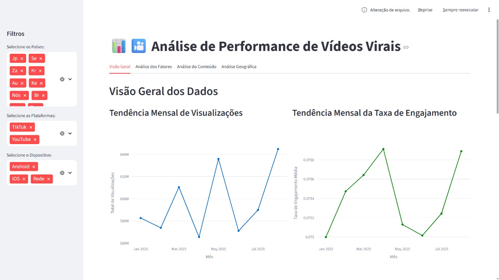
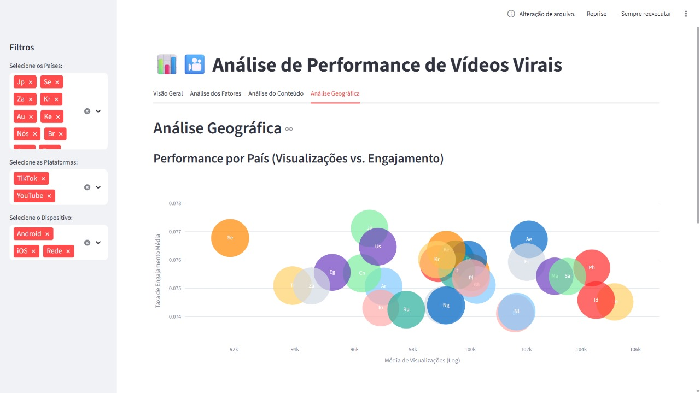

# 📊 Dashboard de Análise de Vídeos Virais (TikTok & YouTube)

<p align="center">
  
</p>

<p align="center">
  <a href="https://tktk-and-youtube-analysis.streamlit.app/" target="_blank">
    
  </a>
</p>

<p align="center">
  <a href="#-descrição-do-projeto">Descrição</a> •
  <a href="#-principais-funcionalidades">Funcionalidades</a> •
  <a href="#-preview-do-dashboard">Preview</a> •
  <a href="#️-tecnologias-utilizadas">Tecnologias</a> •
  <a href="#-como-executar-o-projeto">Como Executar</a> •
  <a href="#-autor">Autor</a>
</p>

## 📖 Descrição do Projeto

Este projeto consiste em um dashboard interativo construído para a análise exploratória de dados de vídeos virais do TikTok e YouTube Shorts. O objetivo é aplicar técnicas de Data Science para identificar os principais fatores que impulsionam o engajamento e a viralização de conteúdo em formato curto.

O painel foi desenvolvido como um projeto prático para demonstrar habilidades em ETL, análise estatística, modelagem de machine learning e desenvolvimento de aplicações web interativas com Python.

### Sobre o Conjunto de Dados

Os dados utilizados foram obtidos da plataforma Kaggle e agregam uma rica coleção de informações sobre vídeos, incluindo métricas de performance, atributos de conteúdo e dados contextuais. Para mais detalhes, acesse o [dataset original aqui](https://www.kaggle.com/datasets/tarekmasryo/youtube-shorts-and-tiktok-trends-2025).

---

## ✨ Principais Funcionalidades

-   **Visão Geral:** Métricas consolidadas, tendências temporais de visualizações e engajamento médio.
-   **Análise de Fatores:** Análise de como a duração, hora de postagem, dia da semana e categoria impactam a performance.
-   **Análise de Conteúdo:** Extração das palavras-chave mais relevantes, análise de sentimento dos comentários com NLP e teste A/B sobre o uso de emojis nos títulos.
-   **Análise Geográfica:** Visualização de performance por país e um heatmap de engajamento por região e categoria.
-   **Filtros Interativos:** Permite segmentar toda a análise por País, Plataforma e Tipo de Dispositivo.

---

## 🖥️ Preview do Dashboard

<table align="center">
  <tr>
    <td align="center"><strong>Visão Geral</strong></td>
    <td align="center"><strong>Análise Geográfica</strong></td>
  </tr>
  <tr>
    <td></td>
    <td></td>
  </tr>
</table>

---

## 🛠️ Tecnologias Utilizadas

Este projeto foi construído utilizando um ecossistema moderno de ferramentas de Python para análise e visualização de dados.

<p align="center">
  
  
  
  
  
  
  
</p>

---

## 🚀 Como Executar o Projeto

Para executar este dashboard interativo em sua máquina local, siga os passos abaixo:

1.  **Clone o repositório:**
    ```bash
    git clone [https://github.com/jaimejrs/tiktok-and-youtube-analysis.git](https://github.com/jaimejrs/tiktok-and-youtube-analysis.git)
    ```

2.  **Navegue até o diretório do projeto:**
    ```bash
    cd tiktok-and-youtube-analysis
    ```

3.  **Crie e ative um ambiente virtual (recomendado):**

    * **No Linux ou macOS:**
        ```bash
        python3 -m venv venv
        source venv/bin/activate
        ```
    * **No Windows:**
        ```powershell
        python -m venv venv
        .\venv\Scripts\activate
        ```

4.  **Instale as dependências necessárias:**
    ```bash
    pip install -r requirements.txt
    ```

5.  **Adicione o arquivo de dados:**
    Certifique-se de que o arquivo `youtube_shorts_tiktok_trends_2025.csv` esteja localizado na raiz do diretório do projeto.

6.  **Execute o aplicativo Streamlit:**
    ```bash
    streamlit run app.py
    ```
Após executar o último comando, uma aba no seu navegador será aberta com o dashboard em funcionamento.

---

## 👨‍💻 Autor

Feito com ❤️ por **JaimeJrs**.

[](https://www.linkedin.com/in/jaimejrs/)
[](https://github.com/jaimejrs)
[](https://medium.com/@jaimejrs)
